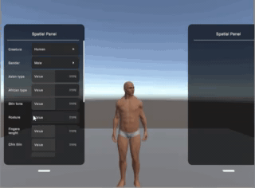

# VR Avatars for Older Adults

Bachelor's thesis by Ivan Pavlov, Karlsruhe Institute of Technology, 2024.

The thesis explores how VR avatar creation can better represent older adults. It
includes a Unity prototype for customizing an avatar's aged appearance, such as
body shape and posture, hair, and clothing.

[Read the thesis (PDF)](paper/VR_Avatars_for_Older_Adults.pdf) ·
[View the thesis presentation (PDF)](paper/Final%20Presentation_PavlovIvan_VR_Avatars_for_Older_Adults.pdf)

*Recovered recording of the posture control; it shows a historical project state,
not a test of the current Unity migration.*

## Documentation

- [Setup and project layout](docs/SETUP.md)
- [How the prototype works](docs/ARCHITECTURE.md)
- [Verification status and test checklist](docs/TESTING.md)

## Repository layout

- `paper/` contains the thesis and presentation PDFs.
- `dev/Avatar creator/` contains the Unity prototype.
- `docs/` contains the maintained project documentation and demo media.

## Unity project

Open `dev/Avatar creator/` as a project in Unity **6000.2.10f1**. The project
contains UMA **2.13.f2** under `Assets/UMA/`.

Several scenes reference UMA's `UMA_GLIB` prefab by its Unity asset GUID. The
matching `Assets/UMA/Getting Started/UMA_GLIB.prefab` and `.meta` file are kept
in the repository so those references resolve on a fresh clone. They were
restored from a locally cached UMA 2 package. Other files in UMA's
`Getting Started` and `Examples` folders remain ignored; importing the whole
package again is not required to restore this prefab.

The project is undergoing a Unity version migration. On 29 September 2026,
the `Customized Options` scene compiled and showed no Console errors after a
script reload. The thesis-era version was used with a Meta Quest 3; the current
Unity 6 version has not been tested on a headset. Other scenes and builds have
not yet been verified. See the [testing checklist](docs/TESTING.md) before
assuming device support.

## License

The [thesis license](LICENSE.md) applies to original thesis content only. It
does not license the Unity project or third-party assets in `dev/`; consult
their own license notices and terms before reuse or redistribution.
