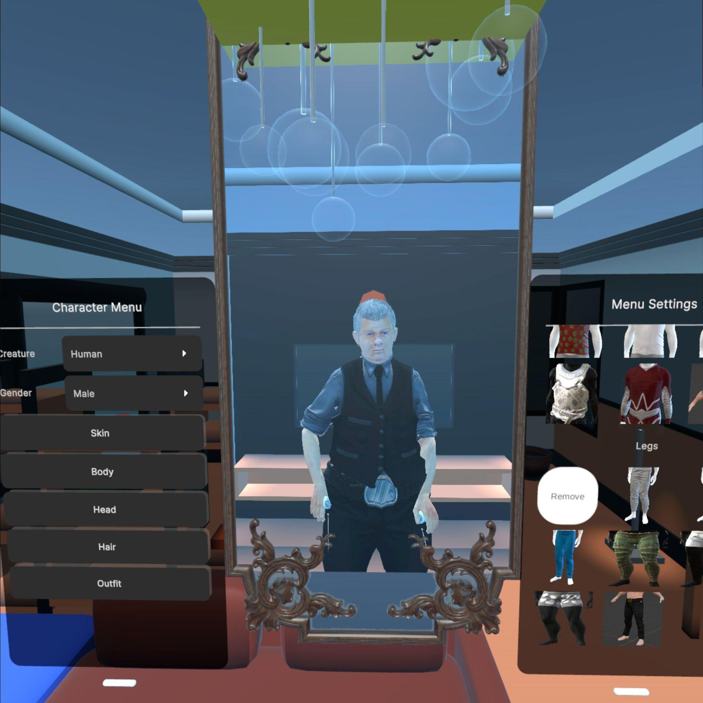
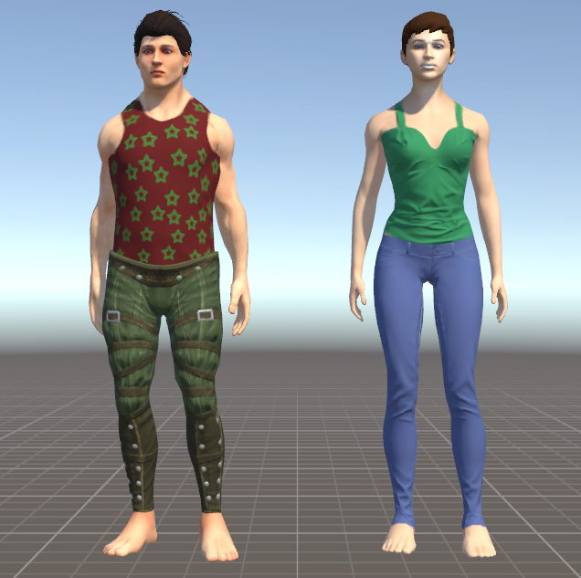
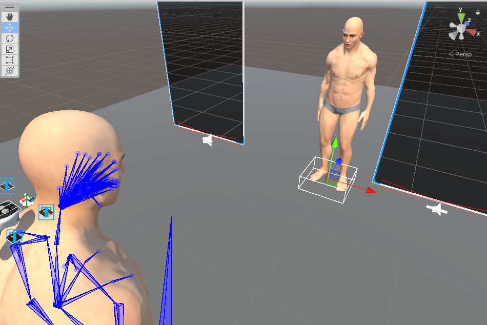

# Prototype architecture

This is a guide to the checked-in design, based on the original project notes
and current scripts. It describes how the prototype is intended to work; the
Unity 6 runtime behavior still needs [verification](TESTING.md).

*Prototype screenshot from the [thesis presentation](../paper/Final%20Presentation_PavlovIvan_VR_Avatars_for_Older_Adults.pdf), slide 3. It shows the historical interface, not a verified Unity 6 build.*

## Avatar customization

The project uses UMA's `DynamicCharacterAvatar` (DCA) to construct a character
from a race, DNA values, colors, and wardrobe recipes. The UI supports the
`HumanMale` and `HumanFemale` races. The original notes discuss a nonbinary
choice as an experiment, but it is commented out in the current
`HumanoidAvatarCreator` script and was not part of the final prototype.

`HumanoidAvatarCreator` builds controls for five menu states:

| Menu | Main controls |
| --- | --- |
| Skin | Skin-related DNA and a separate older-skin recipe toggle. |
| Body | Body proportions and posture DNA. |
| Head | Facial and head DNA, related slots, and eye or lip colors. |
| Hair | Hair and related wardrobe choices, color, and density. |
| Outfit | Clothing wardrobe recipes. |

The UI also exposes additional DNA and slot inspection states in the Unity
Editor. Controls are built from prefabs as the selected menu state changes.
UMA DNA values alter properties of the generated character through race DNA
and converter assets. The thesis-specific posture parameter was designed to
adjust spine rotation and shoulder positions. Shared colors and wardrobe
recipes provide other appearance changes, including hair, clothing, and skin
details.

UMA wardrobe recipes fill named slots and can provide clothing, hair, or
appearance changes. The screenshot below shows two historical outfit examples.

*Wardrobe examples from the [original project notes](archive/Documentation-2024.pdf), page 7.*

The main implementation is under `Assets/Avatar creator/Scripts/`:

- `HumanoidAvatarCreator.cs` creates the menu states and controls.
- `HumanoidAvatarManager.cs` coordinates the three UMA characters.
- `UI Elements/` contains individual controls such as DNA sliders and color
  choices.
- `VR Embodiment/` contains body tracking and positioning components.

## Three character views

`HumanoidAvatarManager` coordinates three DCA objects:

- **Virtual body:** the character seen from the user's own viewpoint and
  driven by VR embodiment controls.
- **Reflection:** the visible avatar used to inspect appearance changes.
- **T-pose avatar:** a separate character for measurement and comparison.

The manager forwards race, DNA, wardrobe, color, and rebuild operations to
all three. Their components and wardrobe are deliberately not identical.
For example, the virtual body uses `No Head` and `No Hair` recipes so the
camera does not look into the inside of its own head. `TripledDNABase` forwards
DNA writes to the three characters.

*Early development view from the [original project notes](archive/Documentation-2024.pdf), page 6. This image shows the earlier two-avatar setup; the manager now defines three views.*

## VR interface

The prototype builds on imported Unity VR template assets for spatial panels
and interaction. In the historical version, sliders could be operated with a
mouse, controller pointer, or direct poke; panels supported scrolling,
grabbing, moving, and scaling. These interactions need a fresh headset check
after migration. The current build scene is
`Assets/Avatar creator/Scenes/Customized Options.unity`.

## Historical rigging note

The original documentation describes a brief pose jump when UMA rebuilt a
character and animator or IK targets returned to their initial positions. The
repository still contains experimental workaround code related to this. Its
behavior in the current version is unverified. If the problem reproduces,
capture exact steps and device logs in a separate bug issue rather than
assuming the historical explanation remains correct.
